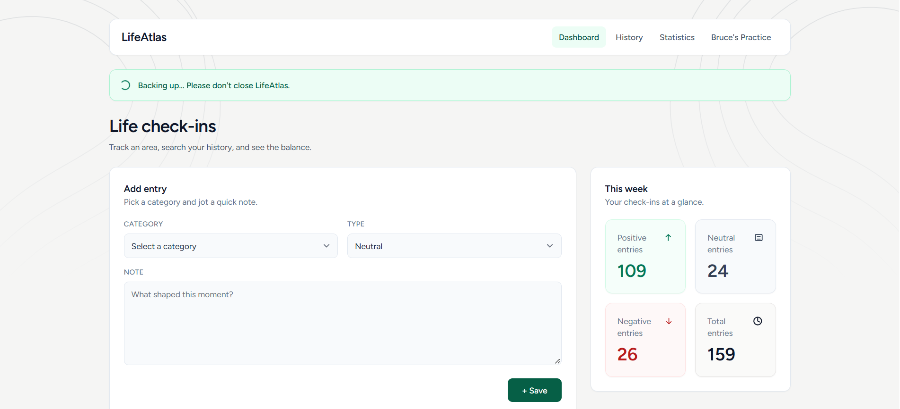
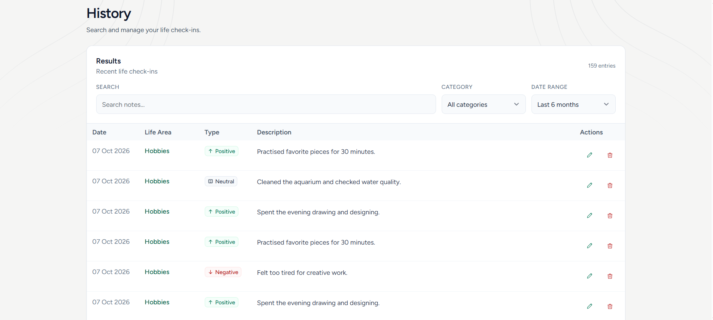
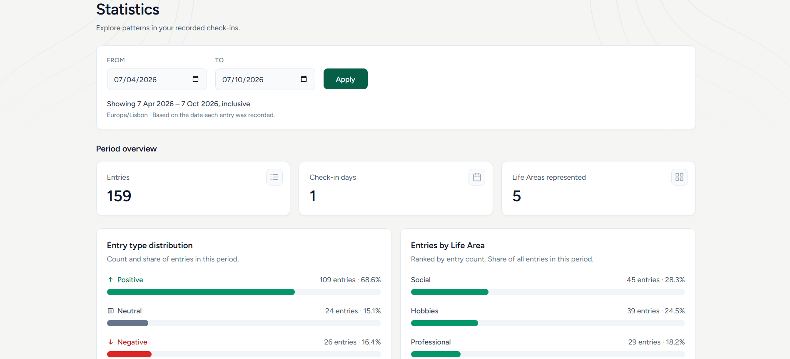
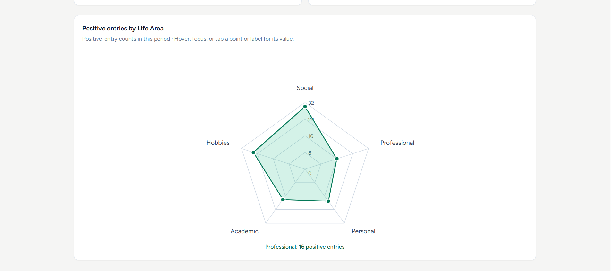

# LifeAtlas

LifeAtlas is a local-first personal development and journaling application, built for my own reflective practice. It combines structured check-ins with tools to search past entries and explore patterns over time.

This repository presents **LifeAtlas V1**, the first portfolio-ready version of the application, with a defined scope for local, single-user use.



## About the project

Each check-in contains a Life Area, a description, and a Positive, Neutral, or Negative classification.

I built LifeAtlas for my own personal development and journaling practice. A traditional notebook works well for recording thoughts, but I wanted to search and retrieve past entries, revisit specific Life Areas, and compare different periods. LifeAtlas keeps the reflective value of journaling while adding structure and ways to explore patterns that can be difficult to see across notebook pages.

History provides a way to search and revisit past entries. Statistics helps explore accumulated entries through counts, distributions, and comparisons between periods, making patterns over time easier to examine.

## Engineering & continuous learning

LifeAtlas provides a practical environment for continuing to strengthen my software-engineering practice, from database querying and background processing to interface design, testing, and reliability.

I am also studying AI and Deep Learning and exploring how LLM-assisted tools can be integrated effectively into real development workflows. Those studies complement my practical work with these tools. LifeAtlas’s product functionality remains focused on journaling and reporting, with engineering decisions and validation under my ownership.

## Core features

- **Dashboard:** create check-ins and view current-week totals by classification.
- **History:** combine description search, date presets, and Life Area filters; browse paginated results; edit entries or confirm their deletion.
- **Statistics:** apply custom date ranges to summary counts, type percentages, Life Area rankings, and a positive-entry radar chart.
- **Local database backups:** Dashboard use triggers the daily backup decision. Eligible backups run in the background, with visible status and retention of the latest five completed backups.

## Engineering highlights

### 1. Date-range statistics and visualization

Statistics separates draft date inputs from the currently applied range. Results change only after successful validation, keeping every reporting section aligned with the same period.

Date ranges include both selected dates. Queries start at midnight on the first date and stop before midnight following the final date. Calendar calculations use Europe/Lisbon and avoid month-subtraction overflow.

SQL aggregation calculates total entries, distinct check-in days, classification percentages, and Life Area counts without loading individual entries into application memory. Areas with no activity remain visible, and empty periods have explicit zero states.

A native SVG radar chart adapts to the available areas and data scale. Axis positions remain stable when rankings change, while Alpine.js supports pointer and keyboard interactions. The chart measures **positive-entry frequency**, rather than a scientifically validated wellbeing score.

Evidence: [Statistics component](app/Livewire/Stats.php), [radar visualization](resources/views/components/life-area-radar.blade.php), and [Statistics tests](tests/Feature/StatsTest.php).

### 2. Reliable queued local backups

Dashboard checks whether a backup is needed for the current day. Laravel’s database queue moves the dump into a background job, processed by a dedicated Docker worker.

A unique backup-date constraint, transactional coordination, and overlap protection reduce duplicate work. Backup records track pending, running, completed, and failed states.

The job writes to a temporary file, checks that the output is nonempty, and renames it to its final location after successful completion. Failure handling removes temporary output and records a readable status. Dump diagnostics are filtered before logging, and a failed backup can be retried through a subsequent Dashboard visit.

After success, retention attempts to keep the latest five completed backups. Retention errors are handled separately so they do not invalidate a newly completed backup.

Evidence: [Dashboard trigger](app/Livewire/Dashboard.php), [backup job](app/Jobs/CreateBackup.php), [backup schema](database/migrations/2026_09_14_000000_create_backups_table.php), and [Docker services](compose.yaml).

### 3. Consistent History filtering and pagination

History combines description search, date filtering, and Life Area selection in one database query. Results use server-side pagination, with 15 entries per page and deterministic ordering by timestamp and ID.

Changing a filter resets pagination. Editing and deleting preserve active filters, and the component recovers when a change removes the final result on the current page.

Records removed while an edit or deletion dialog is open are handled gracefully. These decisions keep navigation and feedback consistent as the underlying data changes.

Evidence: [History component](app/Livewire/History.php) and [History tests](tests/Feature/HistoryTest.php).

## Screenshots

The screenshots below use fictional demo data.

### Dashboard

Check-in creation and current-week activity.


### History

Search, combined filters, classifications, and paginated results.



### Statistics

Date-range statistics, summary counts, classifications, and Life Area distribution.



Positive-entry frequency across Life Areas.



## Architecture & Tech Stack

LifeAtlas is a Laravel monolith with class-based Livewire page components and Blade views. Eloquent models connect Life Areas to check-ins through a one-to-many relationship. Filtering, pagination, and reporting queries run server-side; Alpine.js handles lightweight interface interactions.

Docker Compose separates the application, MariaDB database, and queue worker. A dedicated Node dependency volume isolates container dependencies from the host project mount.

| Layer | Technology |
|---|---|
| Language | PHP `^8.2` requirement; Sail configured for PHP 8.5 |
| Application | Laravel 12.65.0, Livewire 3.8.3, Blade |
| Interface | Alpine.js, Tailwind CSS 3.4.19, native SVG |
| Database | MariaDB 11 Docker image, Eloquent |
| Background work | Laravel database queue |
| Local environment | Docker Compose, Laravel Sail 1.65.0 |
| Frontend build | Vite 7.3.6 |
| Testing and formatting | PHPUnit 11.5.56, Laravel Pint |

Versions reflect tracked dependency lockfiles and container configuration.

## Testing

Automated feature tests cover key behavior in History, Statistics, and backup handling, including filtering and pagination, date-range reporting, and backup dispatch and failure handling. Database-backed tests use in-memory SQLite, with fakes isolating relevant external operations. The full Docker test suite passed: **52 tests, 437 assertions**.


See [feature tests](tests/Feature) and [PHPUnit configuration](phpunit.xml).

## AI-assisted development workflow

I use LLM-assisted tools for technical exploration, code analysis, solution planning, scoped implementation support, and debugging. I remain responsible for product decisions, architecture, scope, code review, testing, manual validation, and acceptance of changes.

The workflow follows:

**Problem definition → reasoning and solution design → scoped AI-assisted exploration or implementation → code inspection → automated testing → manual validation and review → Git commit**

My ongoing AI and Deep Learning studies complement this practical use by deepening my understanding of the technologies. LifeAtlas provides a software-engineering context in which to apply and evaluate that evolving approach.

## Project scope

LifeAtlas V1 is intentionally designed for local, single-user use. Its implemented scope focuses on check-ins, History, Statistics, and local data protection.

Daily backups are triggered through Dashboard use and stored locally. The radar provides a visual comparison of positive-entry frequency across Life Areas; it is not a scientifically validated wellbeing metric.

The environment documented here is for local use.

## Running locally

### Requirements

- Git
- Docker Desktop with Docker Compose
- Compatible PHP and Composer for installing dependencies before building Sail

### 1. Clone and configure

```bash
git clone https://github.com/M-Araujo/LifeAtlas.git
cd LifeAtlas
```

Create the environment file:

```bash
cp .env.example .env
```

On PowerShell:

```powershell
Copy-Item .env.example .env
```

Configure MariaDB to use the Docker service host `mariadb`. Set the queue connection to `database` and `DB_QUEUE_RETRY_AFTER` to `720`, exceeding the worker’s 660-second timeout. Keep local credentials in `.env`.

### 2. Install PHP dependencies

With compatible PHP and Composer available locally:

```bash
composer install
```

Composer dependencies must exist before the Docker build because the configured Sail runtime is located inside `vendor`.

### 3. Start services and initialize the database

Start the application and database before the queue worker:

```bash
docker compose up -d laravel.test mariadb
docker compose exec laravel.test php artisan key:generate
docker compose exec laravel.test php artisan config:clear
docker compose exec laravel.test php artisan migrate --seed
```

The seeders create Life Areas and synthetic entries.

### 4. Build frontend assets and start the worker

```bash
docker compose exec laravel.test npm ci
docker compose exec laravel.test npm run build
docker compose up -d queue
```

Open **http://localhost** with the default port configuration.

For frontend development:

```bash
docker compose exec laravel.test npm run dev
```

### Run tests

```bash
docker compose exec laravel.test composer test
```

This clears cached configuration and runs the suite using the in-memory SQLite test configuration.

## Project status

**LifeAtlas V1**

This is the first portfolio-ready version of LifeAtlas, with a defined, implemented scope covering check-in creation, searchable History, date-range Statistics, and queued local backups.

The application may continue evolving as my software-engineering practice and AI knowledge develop.
